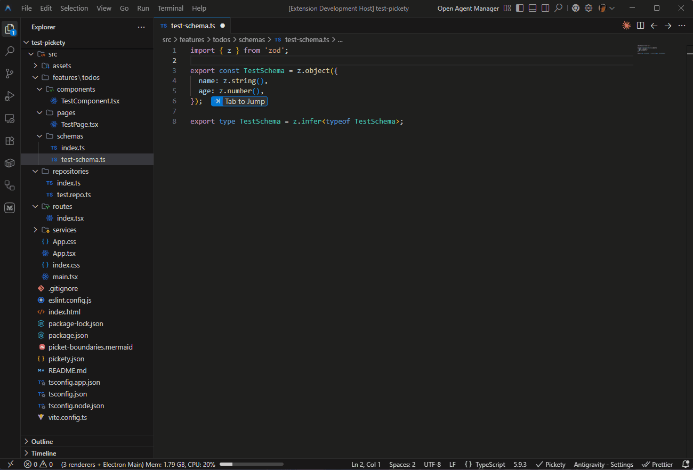

# Pickety

**Architectural guardrails for TypeScript projects.**

<p align="left">
  <a href="LICENSE">
    
  </a>
</p>

---

Pickety is a VS Code extension that stops architecture erosion before it starts. Define your module boundaries once in a simple JSON file, and every illegal import lights up instantly -- right in your editor, as you type. No more "we don't import that here" comments in code review. No more accidental coupling that quietly rots your codebase over months.

Zero runtime dependencies. Zero build steps. Just drop in a config and your entire team gets real-time, visual enforcement of the rules that actually matter.



---

## Why Pickety?

Every growing TypeScript codebase develops architectural rules:

- Features shouldn't import other features
- Shared components can't reach into the app layer
- Utilities must remain dependency-free
- Routes should only access their own feature's pages

These rules live in developers' heads and break silently. Pickety makes them **explicit, enforceable, and visible**.

### Built for the AI era

AI coding agents are fast but don't know your architecture. Pickety keeps them on rails -- violations appear the instant an agent writes a bad import, not after a review cycle. Works with Claude Code, GitHub Copilot, Cursor, and any tool that edits files in VS Code.

---

## Why not just use ESLint?

ESLint is great at code-level rules -- naming conventions, unused variables, consistent syntax. Pickety solves a different problem: **architecture-level rules** that ESLint was never designed for.

|                              | ESLint                                                 | Pickety                                                      |
| ---------------------------- | ------------------------------------------------------ | ------------------------------------------------------------ |
| **Scope**                    | Single-file lint rules                                 | Cross-module boundary enforcement                            |
| **Setup**                    | Plugin ecosystem, parser config, flat config migration | One `pickety.json` file                                      |
| **Boundary logic**           | `no-restricted-imports` with manual regex per path     | Declarative module map + glob-based rules                    |
| **Interpolation**            | Not supported                                          | `$name` variables enforce scoped relationships automatically |
| **Strict containment**       | Not supported                                          | `only` and `containedTo` whitelist who can import a target   |
| **Architectural visibility** | None                                                   | Auto-generated Mermaid boundary diagrams                     |
| **Health metrics**           | None                                                   | Coupling, instability, and dependency depth per module       |
| **Impact analysis**          | None                                                   | Transitive dependent graph before you refactor               |
| **Gradual adoption**         | All-or-nothing per rule                                | `maxViolations` lets you ratchet down tech debt over time    |
| **Dependencies**             | Dozens of transitive deps                              | Zero (Self-contained)                                        |

ESLint's `no-restricted-imports` can block a handful of hard-coded paths. But the moment you need "features can't cross-import each other" or "route X can only touch feature X's pages", you're writing fragile regex that nobody maintains. Pickety expresses those constraints in a few readable lines and enforces them in real time.

**Use both.** Let ESLint handle code style and correctness. Let Pickety handle the architectural rules that keep your codebase from quietly rotting.

---

## Features

- **Real-time enforcement** -- violations appear as you type, not just on save
- **Glob patterns** -- flexible module definitions using [minimatch](https://github.com/isaacs/minimatch) syntax
- **Interpolation variables** -- enforce scoped relationships like "route X can only import from feature X"
- **Strict enforcement** -- use `only` and `containedTo` to restrict modules to specific consumers
- **Per-rule severity** -- mark some boundaries as hard errors and others as soft warnings
- **Debt tracking** -- set a `maxViolations` threshold per rule to adopt boundaries gradually in legacy codebases
- **Named rules** -- identify exactly which rule triggered a violation
- **tsconfig.json alias support** -- automatically resolves `@/*` and other path aliases
- **Boundary diagrams** -- auto-generate Mermaid diagrams of your architecture
- **Impact Analysis** -- see exactly who depends on a file (transitively) before refactoring
- **Module Health** -- track coupling, instability, and dependency depth across your project
- **Quick fixes** -- jump directly to the rule in `pickety.json` from any violation
- **Status bar** -- always know whether Pickety is active and how many violations exist
- **CLI** -- `pickety check` for CI/CD pipelines, matching IDE behavior exactly
- **JSON Schema** -- autocomplete and inline validation for `pickety.json`
- **No external dependencies** -- self-contained bundle requires zero `npm install` at runtime
- **Zero config beyond `pickety.json`** -- no build plugins, no complex environment to set up

---

## Quick Start

**1. Install** the Pickety extension from the VS Code Marketplace.

**2. Create `pickety.json`** in your workspace root:

```json
{
  "modules": {
    "features": "src/features/*",
    "components": "src/components/**/*",
    "utils": "src/utils/**/*"
  },
  "rules": {
    "module-boundaries": {
      "severity": "error",
      "rules": [
        {
          "importer": "features",
          "imports": "features",
          "name": "no-cross-feature",
          "message": "Features should not import other features directly"
        }
      ]
    }
  }
}
```

**3. Done.** Pickety activates automatically. Violations appear as red/yellow squiggles in the editor, in the Problems panel, and in the status bar.

---

## Configuration

### Modules

Map logical module names to file glob patterns. Each file belongs to the **first** module whose pattern matches.

```json
{
  "modules": {
    "features": "src/features/*",
    "components": "src/components/**/*",
    "hooks": "src/hooks/**/*",
    "utils": "src/utils/**/*"
  }
}
```

> Patterns ending with `/*` are automatically expanded to `/**/*` for deep matching.

### Rules

Each rule defines an import boundary between modules.

| Field         | Type      | Required    | Description                                                              |
| ------------- | --------- | ----------- | ------------------------------------------------------------------------ |
| `imports`     | `string`  | Yes         | Target module name, glob, or file path pattern                           |
| `importer`    | `string`  | Conditional | Source module name or glob pattern. Required unless using `containedTo`. |
| `allow`       | `boolean` | No          | `true` = permit, `false` = forbid. Default: `false`                      |
| `only`        | `boolean` | No          | `true` = the `imports` target can ONLY be used by this `importer`.       |
| `containedTo` | `string`  | No          | Shortcut for `only: true`. Restricts `imports` to this path pattern.     |
| `message`     | `string`  | No          | Custom diagnostic message shown in the editor                            |
| `severity`    | `string`  | No          | `"error"` or `"warn"`. Overrides the global severity                     |
| `name`        | `string`  | No          | Rule identifier. Shown in diagnostics and quick fix labels               |

### Glob Patterns

Both `importer` and `imports` support glob syntax. Use `*` to match all modules:

```json
{
  "importer": "utils",
  "imports": "*",
  "message": "Utils must remain dependency-free"
}
```

When `imports` contains a `/`, it matches against the resolved file's relative path, letting you target subdirectories:

```json
{
  "importer": "routes",
  "imports": "features/**/components",
  "message": "Routes cannot import feature components"
}
```

### Strict Enforcement (`only` & `containedTo`)

Standard rules are "blacklist" style: they forbid specific connections. `only` and `containedTo` are "whitelist" style: they forbid **everyone else** from importing a target.

#### `only`

Use `only` to ensure a module is only consumed by a specific layer:

```json
{
  "importer": "services",
  "imports": "repositories",
  "only": true,
  "message": "Repositories can only be used by the Service layer"
}
```

#### `containedTo`

Use `containedTo` for "private" file patterns that should never leak outside their owner. It is a shortcut for `only: true` where the `importer` is the allowed scope.

```json
{
  "imports": "src/features/$name/internal/*",
  "containedTo": "src/features/$name/**/*",
  "message": "Internal files cannot be imported outside their feature"
}
```

### Interpolation Variables

Use `$variable` placeholders to enforce that path segments match between the importer and the target:

```json
{
  "importer": "routes/$name/*",
  "imports": "features/$name/pages/*",
  "allow": true,
  "message": "Routes must import pages from their matching feature"
}
```

With this rule, `routes/auth/index.ts` can import from `features/auth/pages/` but **not** from `features/billing/pages/`.

---

## Boundary Diagrams

Pickety can auto-generate a [Mermaid](https://mermaid.js.org/) diagram of your module boundaries. Each rule appears as its own section with clear ALLOW/DENY labeling.

Add this to your `pickety.json`:

```json
{
  "boundary-diagrams": true
}
```

Or specify a custom output path:

```json
{
  "boundary-diagrams": "docs/architecture.mermaid"
}
```

You can also generate diagrams on demand via the command palette: **Pickety: Generate Boundary Diagram**.

---

## Impact Analysis

Before refactoring a file, you need to know who depends on it. Pickety's Impact Analysis shows you the transitive dependency chain — every file that might be affected by your change, grouped by the module they belong to.

Run **Pickety: Show Impact** from the command palette to see a searchable list of all files that import the current file (directly or indirectly).

---

## Module Health Metrics

Quantify the quality of your architecture with industry-standard coupling metrics. Pickety analyzes your entire project to compute stability and complexity scores for every module.

- **Afferent Coupling (Ca)**: How many modules depend on this one? (Responsibility)
- **Efferent Coupling (Ce)**: How many modules does this one depend on? (Dependency)
- **Instability (I)**: The ratio `Ce / (Ca + Ce)`. Measures how resilient a module is to external changes.
- **Dependency Depth**: The length of the longest dependency chain starting from this module.

View these metrics anytime using **Pickety: Show Module Health**, or enforce project-wide quality standards in `pickety.json`:


### Built for Humans and Agents

The Module Health feature provides two interfaces depending on who is using it:

- **For Humans:** Running the VS Code command opens a clean, color-coded HTML Webview panel. The table highlights healthy modules in green and unstable or problematic modules in red, making it easy to spot architectural issues at a glance.
- **For AI Agents:** Running the `pickety check` CLI with the `health` argument outputs a clean, ASCII-formatted table directly to stdout. This allows agents to ingest the current state of your architecture and make informed decisions about where to place new code or when refactoring is needed.

```json
{
  "health": {
    "maxInstability": 0.8,
    "maxDepth": 5,
    "maxAfferentCoupling": 20
  }
}
```

Threshold violations appear as diagnostics directly on your `pickety.json` file.

---

## Commands

| Command                              | Description                                     |
| ------------------------------------ | ----------------------------------------------- |
| `Pickety: Refresh Configuration`     | Reload `pickety.json`, aliases, and file index  |
| `Pickety: Generate Boundary Diagram` | Generate a Mermaid diagram of your boundaries   |
| `Pickety: Show Impact`               | See transitive dependents of the active file    |
| `Pickety: Show Module Health`        | View coupling and stability metrics for modules |

---

## Example

A complete configuration enforcing feature isolation, dependency direction, utility purity, and scoped routing:

```json
{
  "modules": {
    "app": "src/app/**/*",
    "features": "src/features/*",
    "components": "src/components/**/*",
    "hooks": "src/hooks/**/*",
    "utils": "src/utils/**/*"
  },
  "rules": {
    "module-boundaries": {
      "severity": "error",
      "rules": [
        {
          "importer": "features",
          "imports": "features",
          "name": "no-cross-feature",
          "message": "Features should not import other features directly"
        },
        {
          "importer": "components",
          "imports": "features",
          "name": "no-component-to-feature",
          "message": "Shared components should not depend on features"
        },
        {
          "importer": "utils",
          "imports": "*",
          "name": "utility-purity",
          "message": "Utils must remain dependency-free"
        },
        {
          "importer": "routes/$name/*",
          "imports": "features/$name/pages/*",
          "allow": true,
          "name": "scoped-routing",
          "message": "Routes must use pages from their matching feature"
        },
        {
          "imports": "src/features/$name/internal/*",
          "containedTo": "src/features/$name/**/*",
          "name": "internal-isolation",
          "message": "Internal feature logic cannot leak outside its feature"
        }
      ]
    }
  },
  "boundary-diagrams": true,
  "health": {
    "maxInstability": 0.7,
    "maxDepth": 4
  }
}
```

For more patterns -- Feature-Sliced Design, Onion Architecture, scoped utilities -- see the [Rule Recipes](docs/recipes.md).

---

## Performance & Limits

Pickety is designed for speed, using optimized regex for import extraction and caching dependency graphs in memory. For most projects, analysis is near-instant.

### Large Workspaces

To prevent IDE hangs on massive codebases, Pickety applies certain limits in the VS Code extension:

- **File Limit:** If your workspace contains more than **5,000** TypeScript/JavaScript source files, Pickety will disable background features (Circular Dependency Detection and Module Health Metrics) for performance.
- **Real-time Boundary Checks:** Standard boundary enforcement on the active file always remains active, regardless of project size.

If these limits are reached, a warning will appear in the **Pickety** output channel. You can still run full project analysis via the CLI: `pickety check`.

### Benchmarks

In a synthetic project with 500 files and 10 modules, a full project analysis (`pickety check`) completes in under **600ms** on a standard developer machine.

---

## Documentation

| Resource                                        | Description                                      |
| ----------------------------------------------- | ------------------------------------------------ |
| [Setup Guide](docs/setup.md)                    | Get running in under 3 minutes                   |
| [Configuration Reference](docs/pickety-json.md) | Full `pickety.json` specification                |
| [Rule Recipes](docs/recipes.md)                 | Common architectural patterns (FSD, Onion, etc.) |

---

## License

[MIT](LICENSE)
